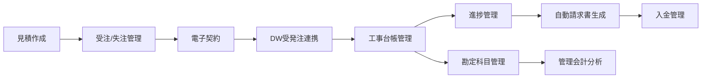

# Claude Code 引き継ぎドキュメント

## 🎯 明日のClaude（またはあなた）へ

### 最重要情報

**最新URL**: https://web-frontend-qt2fly6eh-kosukes-projects-c6ad92ba.vercel.app/
※2025年8月24日時点。新しいデプロイ後は必ず更新すること！

### プロジェクト概要

- **場所**: `/Users/dw100/crm-monorepo/drm-suite/`
- **内容**: 建設業界向けCRM「DRMスイート」完全統合システム
- **技術**: Next.js 14 + TypeScript + Tailwind CSS

---

## 📅 2025年8月24日（土）の実装内容

### 🏗️ 完成した建設業界向け統合CRMシステム

#### 1. DW連携・原価管理システム ✅

**実装ファイル**:

- `/services/dw-integration.service.ts` - DW連携コアサービス
- `/services/construction-ledger.service.ts` - 工事台帳管理
- `/construction/ledger` - 工事台帳UI
- `/construction/analysis` - 原価分析画面
- `/construction/materials` - 材料・労務管理
- `/construction/monitoring` - リアルタイム収益性監視

**主要機能**:

- 受発注データをDWに送信→承認データ受信→原価確定
- 建設業法準拠の工事台帳自動生成
- 予算vs実際原価のリアルタイム差異分析
- 材料費・労務費の詳細トラッキング
- KPIアラート（原価超過/利益率低下/工期遅延）

#### 2. 管理会計システム ✅

**実装ファイル**:

- `/services/accounting-chart.service.ts` - 勘定科目マスタ
- `/accounting/chart` - 勘定科目管理画面
- `/accounting/project` - プロジェクト別管理会計

**建設業特有の勘定科目**:

```
資産: 完成工事未収入金、未成工事支出金
収益: 完成工事高（住宅/店舗/リフォーム）
原価: 完成工事原価（材料費/労務費/外注費/経費）
```

#### 3. 部門間連携強化 ✅

- **経理部門**も工事台帳・原価分析にアクセス可能
- **施工管理**と**経理**でリアルタイムデータ共有
- 勘定科目別のプロジェクト収益性分析

---

## 🔄 現在の業務フロー（完全統合済み）



---

## 🚀 デプロイ・Git管理

### Vercelデプロイ

```bash
cd /Users/dw100/crm-monorepo/drm-suite/web-frontend
vercel --prod
# デプロイ後、新しいURLをこのファイルに記録すること！
```

### Git管理

```bash
# 今日の作業をコミット
git add .
git commit -m "feat: DW連携原価管理・管理会計システム完成
- DWとの受発注データ連携
- 工事台帳・原価分析機能
- 建設業向け勘定科目体系
- プロジェクト別管理会計
- 経理・施工管理部門間データ共有"

# リモートにプッシュ（リポジトリ設定済みの場合）
git push origin main
```

---

## 🔑 重要な実装詳細

### DW連携フロー

1. 受発注データを`dwIntegrationService.sendOrderToDW()`で送信
2. DWからの応答を`processDWResponse()`で処理
3. 承認された原価を工事台帳に自動反映
4. 差異がある場合はアラート生成

### 勘定科目階層

```
Level 1: 大分類（流動資産、完成工事高、完成工事原価）
Level 2: 中分類（現金預金、材料費、労務費）
Level 3: 小分類（普通預金、基礎工事材料費）
Level 4: 補助科目（○○銀行普通預金）
```

### アクセス権限

- `施工管理`: /dashboard/construction, /construction/\*
- `経理担当`: /dashboard/accounting, /accounting/_, /construction/_（閲覧）
- `経営者`: 全機能アクセス可能

---

## 🔧 開発環境

### ローカル起動

```bash
cd /Users/dw100/crm-monorepo/drm-suite/web-frontend
pnpm dev
# http://localhost:3001 で起動
```

### 必要な環境変数（.env.local）

```
NEXT_PUBLIC_DW_API_URL=https://dw.example.com/api
# 他の電子契約API設定など
```

---

## 📝 明日やるべきこと

### 優先度高

1. Vercelへの最新デプロイ
2. GitHubへのプッシュ（リポジトリ未設定なら設定から）
3. 環境変数の本番設定

### 次の機能候補

- [ ] 承認ワークフロー実装
- [ ] 月次決算レポート自動生成
- [ ] 税務申告用データエクスポート
- [ ] 監査ログ機能

---

## ⚠️ 注意事項

1. **LocalStorage使用中**: 本番環境ではDBに移行必要
2. **DW API**: 現在モック実装。本番APIエンドポイント設定必要
3. **Chart.js**: SSR無効化済み（dynamic import使用）

---

最終更新: 2025年8月24日 23:23
作業者: Claude（AI）
確認者: あなた！

明日も頑張りましょう！💪
