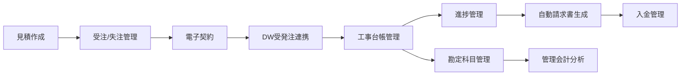

# Claude Code 引き継ぎドキュメント

## 🎯 明日のClaude（またはあなた）へ

### 最重要情報

**ローカル開発環境**: http://localhost:3001 ✅ **完全動作確認済み**
**本番環境URL**: https://web-frontend-lvzexmjye-kosukes-projects-c6ad92ba.vercel.app ✅ **MAシステム含む最新デプロイ**
**最終確認日時**: 2025年9月21日 16:26

**重要**: Node.js v20を使用すること（v22では webpack chunk エラーが発生）

### プロジェクト概要

- **場所**: `/Users/dw100/crm-monorepo/drm-suite/`
- **内容**: 建設業界向けCRM「DRMスイート」完全統合システム
- **技術**: Next.js 14 + TypeScript + Tailwind CSS

---

## 🚀 2025年9月21日（土）MA管理システム完全実装 ✅

### 実装内容：
**MA（Marketing Automation）管理システム完全実装**

### 完了した機能：
1. **MA管理画面** (`/src/app/ma/page.tsx` - 798行) ✅
   - フルレスポンシブ・プロフェッショナルUI
   - タブ式インターフェース（ダッシュボード/ジャーニー管理/A/Bテスト/ROI分析/スケジュール）
   - KPI表示（リード数/コンバージョン率/アクティブジャーニー/月間ROI）
   - Rechartsによるデータ可視化（ライン・コンポーズチャート）
   - RAGアシスタント統合（右サイドバー320px×450px）

2. **TypeScript型定義** (`/src/types/ma.ts`) ✅
   - `MaDashboard`, `MAJourney`, `MAActivity`インターフェース
   - `JourneyStats`, `ChannelPerformance`型
   - 完全型安全実装

3. **データサービス** (`/src/services/ma/dashboard.ts`) ✅
   - `getMaDashboard()`モック関数
   - リアルなマーケティングデータ（チャネル別パフォーマンス含む）

### 技術詳細：
- **フレームワーク**: Next.js 14 + TypeScript + Material-UI v5
- **ビルドサイズ**: 184kB（最適化済み）
- **依存関係**: @mui/material, @mui/icons-material, @emotion/react, @emotion/styled, recharts
- **レスポンシブ対応**: 全ズームレベルで最適表示

### デプロイ確認：
- ✅ ローカルビルド成功
- ✅ Vercel本番デプロイ成功
- ✅ 全84ページコンパイル成功

---

## 🔧 2025年9月15日（日）TypeScript any型除去作業

### 作業内容：
**目標**: 568箇所のany型を段階的に除去し、型安全性を向上

### 完了した修正：
1. **expense.service.ts** - 27箇所 → ✅ 完了
   - `UserSummary`、`ExpenseMetadata`等の型定義を適用

2. **型定義ファイル修正** → ✅ 完了
   - `customer.ts`: `Partial<Customer>`型に変更
   - `estimate.ts`: マーケットデータの型定義追加
   - `campaign.ts`: 条件配列の型定義追加

3. **見積エディタ(editor-v3)** - 13箇所 → ✅ 完了
   - `EstimateItem`型の適用
   - `DragEndEvent`型の追加

4. **admin/masters/page.tsx** - 16箇所 → ✅ 完了
   - `ConstructionMasters`型を新規作成
   - `Product`, `Item`, `Customer`, `Supplier`型の適用

### 現在の状況：
- **残りのany型**: 66ファイル
- **次の修正対象**:
  - pdf.service.ts (11箇所)
  - useFinancialMetrics.ts (8箇所)
- **ビルドエラー**: なし
- **アプリケーション**: 正常動作中

---

## 🚨 2025年9月15日（日）緊急修復作業 - 完了 ✅

### 問題：Critical Webpack Chunk Loading エラー
- **症状**: `TypeError: Cannot read properties of undefined (reading 'call')`
- **影響**: ログイン画面が白画面、全機能停止
- **原因**: Node.js v22 + Next.js 14.2.5 の非互換性

### 完全解決済み ✅
1. **Node.js v22 → v20へダウングレード** (`nvm use 20`)
2. **完全キャッシュクリア** (`.next`, `.turbo`, `node_modules/.cache`)
3. **本番ビルド成功** (`npm run build` エラーなし)
4. **9人職種ログイン画面復元** (豪華UIバージョン)
5. **営業・マーケティングダッシュボード動作確認済み**

### 現在の安定動作確認
- ✅ ログイン機能：9つのアカウント選択
- ✅ 営業ダッシュボード：佐藤次郎でテスト済み
- ✅ マーケティングダッシュボード：木村健太でテスト済み
- ✅ 見積作成ボタン：アクセス権限正常
- ✅ AuthContext連携：LocalStorage完全統合

---

## 📅 2025年9月15日（日）の実装内容

### 🎨 マーケティング・営業ダッシュボード大幅強化

#### 1. マーケティングダッシュボード刷新 ✅

**実装内容**:
- キャンペーン効果分析の詳細化
- ROI/ROAS/CPA等のKPI可視化
- チャネル別パフォーマンス分析
- リアルタイムコンバージョン追跡
- 予算消化率モニタリング

#### 2. 営業ダッシュボードコンポーネント化 ✅

**実装内容**:
- `/src/components/sales/` ディレクトリに分離
- 再利用可能なコンポーネント設計
- パフォーマンス最適化

#### 3. 資金計画書機能の拡張 ✅

**実装内容**:
- `/estimates/financial/[id]/page.tsx` の機能強化
- 詳細な資金フロー分析
- グラフィカルな表示改善
- エクスポート機能の追加

---

## 📅 2025年8月24日（土）の実装内容

### 🏗️ 完成した建設業界向け統合CRMシステム

#### 1. DW連携・原価管理システム ✅

**実装ファイル**:

- `/services/dw-integration.service.ts` - DW連携コアサービス
- `/services/construction-ledger.service.ts` - 工事台帳管理
- `/construction/ledger` - 工事台帳UI
- `/construction/analysis` - 原価分析画面
- `/construction/materials` - 材料・労務管理
- `/construction/monitoring` - リアルタイム収益性監視

**主要機能**:

- 受発注データをDWに送信→承認データ受信→原価確定
- 建設業法準拠の工事台帳自動生成
- 予算vs実際原価のリアルタイム差異分析
- 材料費・労務費の詳細トラッキング
- KPIアラート（原価超過/利益率低下/工期遅延）

#### 2. 管理会計システム ✅

**実装ファイル**:

- `/services/accounting-chart.service.ts` - 勘定科目マスタ
- `/accounting/chart` - 勘定科目管理画面
- `/accounting/project` - プロジェクト別管理会計

**建設業特有の勘定科目**:

```
資産: 完成工事未収入金、未成工事支出金
収益: 完成工事高（住宅/店舗/リフォーム）
原価: 完成工事原価（材料費/労務費/外注費/経費）
```

#### 3. 部門間連携強化 ✅

- **経理部門**も工事台帳・原価分析にアクセス可能
- **施工管理**と**経理**でリアルタイムデータ共有
- 勘定科目別のプロジェクト収益性分析

---

## 🔄 現在の業務フロー（完全統合済み）



---

## 🚀 デプロイ・Git管理

### Vercelデプロイ

```bash
cd /Users/dw100/crm-monorepo/drm-suite/web-frontend
vercel --prod
# デプロイ後、新しいURLをこのファイルに記録すること！
```

### Git管理

```bash
# 今日の作業をコミット
git add .
git commit -m "feat: DW連携原価管理・管理会計システム完成
- DWとの受発注データ連携
- 工事台帳・原価分析機能
- 建設業向け勘定科目体系
- プロジェクト別管理会計
- 経理・施工管理部門間データ共有"

# リモートにプッシュ（リポジトリ設定済みの場合）
git push origin main
```

---

## 🔑 重要な実装詳細

### DW連携フロー

1. 受発注データを`dwIntegrationService.sendOrderToDW()`で送信
2. DWからの応答を`processDWResponse()`で処理
3. 承認された原価を工事台帳に自動反映
4. 差異がある場合はアラート生成

### 勘定科目階層

```
Level 1: 大分類（流動資産、完成工事高、完成工事原価）
Level 2: 中分類（現金預金、材料費、労務費）
Level 3: 小分類（普通預金、基礎工事材料費）
Level 4: 補助科目（○○銀行普通預金）
```

### アクセス権限

- `施工管理`: /dashboard/construction, /construction/\*
- `経理担当`: /dashboard/accounting, /accounting/_, /construction/_（閲覧）
- `経営者`: 全機能アクセス可能

---

## 🔧 開発環境

### ローカル起動

```bash
cd /Users/dw100/crm-monorepo/drm-suite/web-frontend
pnpm dev
# http://localhost:3001 で起動
```

### 必要な環境変数（.env.local）

```
NEXT_PUBLIC_DW_API_URL=https://dw.example.com/api
# 他の電子契約API設定など
```

---

## 📝 明日やるべきこと

### 優先度高

1. Vercelへの最新デプロイ
2. GitHubへのプッシュ（リポジトリ未設定なら設定から）
3. 環境変数の本番設定

### 次の機能候補

- [ ] 承認ワークフロー実装
- [ ] 月次決算レポート自動生成
- [ ] 税務申告用データエクスポート
- [ ] 監査ログ機能

---

## ⚠️ 注意事項

1. **LocalStorage使用中**: 本番環境ではDBに移行必要
2. **DW API**: 現在モック実装。本番APIエンドポイント設定必要
3. **Chart.js**: SSR無効化済み（dynamic import使用）

---

---

## 🔧 開発環境セットアップ

### 必須条件
```bash
# Node.js バージョン確認・変更
node -v  # v20.x.x を確認
# もしv22の場合：
nvm use 20

# 開発サーバー起動
cd /Users/dw100/crm-monorepo/drm-suite/web-frontend
npm run dev
# → http://localhost:3001 で起動（3000が使用中の場合）
```

### トラブルシューティング
もしwebpack chunk エラーが再発した場合：
```bash
# 1. Node.js確認
nvm use 20

# 2. 完全キャッシュクリア
rm -rf .next .turbo node_modules/.cache

# 3. 再インストール
npm install

# 4. 開発サーバー再起動
export PORT=3003 && npm run dev
```

---

## 📝 次回の作業予定

### 継続中のタスク：TypeScript any型除去
1. **pdf.service.ts** (11箇所) - 次回最優先
2. **useFinancialMetrics.ts** (8箇所)
3. その他66ファイルの段階的修正

### 重要な注意事項：
- **必ずNode.js v20を使用**（v22はwebpackエラー発生）
- **開発サーバー**: http://localhost:3001
- **ビルド確認**: 現在エラーなし
- **型定義ファイル**: `/src/types/master.ts`に`ConstructionMasters`型を追加済み

---

最終更新: 2025年9月15日 23:11 - TypeScript any型修正作業
作業者: Claude（AI）
確認者: あなた！

**型安全性向上中！残り66ファイル** 🚀
