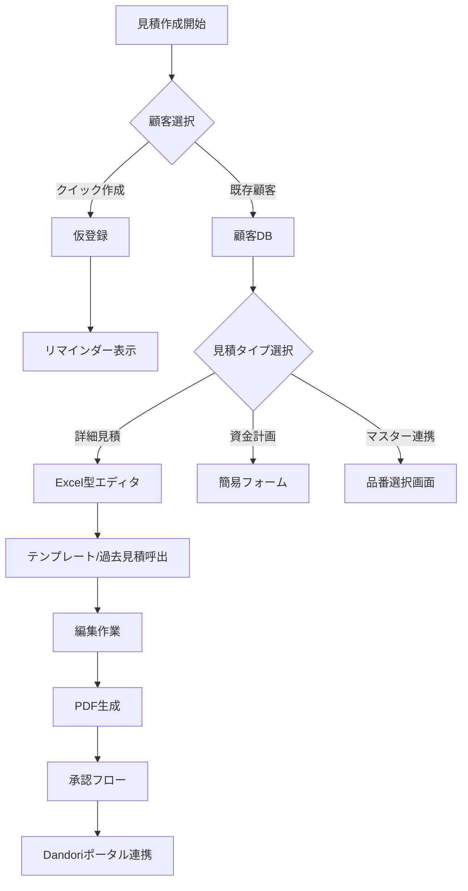

# DRM Suite 見積システム要件定義書

_作成日: 2025-08-23_
_最終更新: 2025-08-23_

## 🎯 ビジョン

**CRMの真価を決める最重要機能として、Excel的操作性とAI機能を融合した次世代見積システム**

---

## 📋 現状分析と課題

### 現在の問題点

1. **複数の入口が存在** - 統一性がなく混乱を招く
   - 見積一覧画面
   - 顧客詳細画面
   - プロジェクト詳細画面
   - RAGアシスタント経由

2. **テンプレート管理の煩雑さ**
   - 画面により3つ〜6つと表示数が異なる
   - カテゴリ分けが不十分

3. **PDF出力の日本語文字化け問題**
   - 現在HTML版で回避中
   - 本格的なPDF生成システムが必要

4. **顧客登録の制約**
   - 顧客登録なしでは見積作成不可
   - クイック見積機能が必要

---

## 🏗️ システム設計

### 1. 見積機能の3本柱

#### 1.1 詳細見積（Excel型）

- **特徴**: 工事明細を細かく積み上げ
- **必須機能**:
  - Tab/Enterキー操作
  - コピー&ペースト（Ctrl+C/V）
  - 右クリックメニュー（行挿入・削除）
  - 計算式の自動反映
  - ドラッグ&ドロップで行の並び替え
- **テンプレート機能**:
  - 作業中いつでも呼び出し可能
  - 部分選択・挿入
  - 複数テンプレート合成
  - 過去見積からのコピー

#### 1.2 資金計画書

- **用途**: 新築住宅向けざっくり見積
- **特徴**:
  - 簡易的な大項目での構成
  - 詳細見積との相互変換可能
  - 建築費部分を後から詳細化

#### 1.3 マスター連携見積

- **機能**:
  - メーカー品番から自動計算
  - 住設機器・水回り関係の一括登録
  - CSVインポート（月1回更新）
- **規模**:
  - メーカー数: 30〜100社
  - 商品点数: 約1万点
  - 掛け率: 一律設定

### 2. テンプレート階層構造

```
会社標準テンプレート
└── 店舗/部署別テンプレート
    └── 担当者個人テンプレート
        └── カスタムテンプレート
```

**例**: 東京支店 → 営業1課 → 田中さん用キッチンリフォームセット

### 3. データフロー



### 4. 承認フロー要件

#### 必要な承認パターン

- **金額による承認者変更**
  - 100万円以下: 課長承認
  - 500万円以下: 部長承認
  - 500万円超: 役員承認

- **並列承認**
  - 営業部長と工事部長の両方の承認

- **条件分岐**
  - 新規顧客は追加承認必要
  - 特定商材は専門部署の承認

#### 設定管理

- システム管理者が設定
- Dandoriポータルとの API連携
- 各テナントで細かく設定可能

### 5. マルチテナント構造

- **1社1テナント方式**
- **スーパー管理アカウント**で全テナント管理
- **各社カスタマイズ**:
  - 会社ロゴ設定
  - 見積フォーマット選択（複数可）
  - 承認フロー個別設定
  - ステータス管理カスタマイズ

---

## 🤖 AI機能統合計画

### AI見積アシスタント機能

1. **自動生成**
   - 過去の類似案件分析
   - 最適な見積もり提案

2. **価格最適化**
   - 受注率 × 利益率分析
   - 最適価格帯の提示

3. **リスク分析**
   - 見積もり漏れ検知
   - 異常値アラート

4. **自然言語入力**
   - 「キッチンリフォーム一式で500万円くらい」→ 自動明細展開

5. **予測入力**
   - 入力開始で候補表示
   - 学習による最適化

---

## 💻 技術スタック

### フロントエンド

- **フレームワーク**: Next.js 14 + TypeScript
- **UI**: Tailwind CSS + Framer Motion
- **スプレッドシート**: Luckysheet or Handsontable
- **状態管理**: Zustand + React Query
- **リアルタイム**: Supabase Realtime

### バックエンド

- **API**: Next.js API Routes
- **DB**: PostgreSQL + Prisma
- **PDF**: Puppeteer + カスタムテンプレート

### AI/ML

- **LLM**: OpenAI GPT-4
- **ベクトルDB**: Pinecone
- **OCR**: Google Vision API

---

## 🎨 UI/UX設計方針

### デザインコンセプト

- **グラスモーフィズム効果**
- **ダークモード対応**
- **スムーズなアニメーション**
- **リアルタイムコラボレーション**

### 操作性

- **Excel的操作を完全再現**
- **ドラッグ&ドロップ対応**
- **キーボードショートカット充実**
- **右クリックメニュー**

### ユーザビリティ

- **使う時に悩まない設計**
- **用途別に明確な導線**
- **AIによる操作支援**

---

## 📊 データモデル

### 見積エンティティ

```typescript
interface Estimate {
  id: string;
  type: 'detailed' | 'financial_plan' | 'master_linked';
  customerId?: string; // クイック作成時はnull可
  status: 'draft' | 'pending_approval' | 'approved' | 'sent' | 'contracted';
  items: EstimateItem[];
  templates: string[]; // 使用したテンプレートID
  metadata: {
    createdFrom:
      | 'estimates_list'
      | 'customer_detail'
      | 'project'
      | 'rag_assistant';
    requiresCustomerRegistration: boolean;
    approvalFlow?: ApprovalFlow;
  };
}

interface EstimateItem {
  id: string;
  category: string;
  name: string;
  quantity: number;
  unit: string;
  unitPrice: number;
  amount: number;
  formula?: string; // 計算式
  masterId?: string; // マスター連携の場合
  copiedFrom?: string; // コピー元の見積ID
}
```

---

## 🚀 実装優先順位

### Phase 1: 基盤構築（最優先）

1. Excel型エディタの実装
2. 基本的なCRUD機能
3. PDF出力（日本語対応）

### Phase 2: テンプレート機能

1. 階層型テンプレート管理
2. 過去見積検索・コピー
3. 部分挿入機能

### Phase 3: AI統合

1. 自動生成機能
2. 価格最適化
3. リスク分析

### Phase 4: 高度な機能

1. マスターデータ連携
2. 承認フロー
3. Dandoriポータル連携

---

## 📝 重要ポイント

### 必ず実現すべきこと

- ✅ Excel的な操作性（Tab/Enter/コピペ）
- ✅ 雛形の柔軟な呼び出し・合成
- ✅ クイック見積（顧客登録なし）+ リマインダー
- ✅ 過去見積の検索・部分コピー
- ✅ 日本語PDF出力
- ✅ マルチテナント対応
- ✅ 承認フロー（金額・並列・条件分岐）

### ユーザー体験の核心

- **「使う時に悩まない」**
- **「用途によって使い分けられる」**
- **「過去の資産を活用できる」**
- **「AIが作業を支援してくれる」**

---

## 🔄 更新履歴

| 日付       | 内容     | 担当          |
| ---------- | -------- | ------------- |
| 2025-08-23 | 初版作成 | Claude + User |

---

## 📌 次のアクション

1. **Luckysheet/Handsontableの技術検証**
2. **データモデルの詳細設計**
3. **UIモックアップ作成**
4. **MVP機能の選定と実装開始**

---

_このドキュメントは生きた仕様書として、開発と共に更新していきます_
