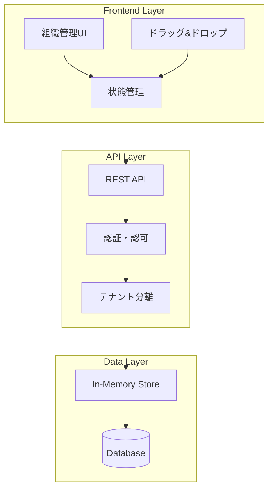

# 🏢 階層型組織構造管理システム 設計・実装ガイド

## 📋 目次
1. [システム概要](#システム概要)
2. [アーキテクチャ設計](#アーキテクチャ設計)
3. [データ構造設計](#データ構造設計)
4. [API設計仕様](#api設計仕様)
5. [フロントエンド実装](#フロントエンド実装)
6. [ドラッグ&ドロップ実装](#ドラッグドロップ実装)
7. [UI/UXパターン](#uiuxパターン)
8. [実装手順ガイド](#実装手順ガイド)
9. [システム間連携](#システム間連携)
10. [コード例](#コード例)

---

## システム概要

### 🎯 目的
企業の組織構造を視覚的に表現し、直感的な操作で組織編成を可能にする管理システム。DandoriPortalとDRM-Suiteで共通利用可能な設計。

### ✨ 主要機能
- **階層型ツリービュー**: 組織構造の視覚化
- **ドラッグ&ドロップ**: 部署の再編成
- **リアルタイム同期**: API経由での即座のデータ保存
- **権限管理**: 役職に応じた操作制限
- **マルチテナント対応**: 企業ごとのデータ分離

### 🔧 技術スタック
```yaml
Frontend:
  - React/Next.js 14
  - TypeScript
  - Tailwind CSS
  - Lucide Icons

Backend:
  - Next.js API Routes (REST)
  - In-Memory Store (本番はDB置換)

将来拡張:
  - GraphQL対応
  - WebSocket (リアルタイム同期)
```

---

## アーキテクチャ設計

### 📐 システム構成図



### 🏗️ コンポーネント構成

```typescript
src/
├── app/
│   ├── admin/
│   │   └── organization/
│   │       └── page.tsx          # メインページ
│   └── api/
│       └── admin/
│           └── departments/
│               └── route.ts      # API エンドポイント
├── components/
│   └── organization/
│       ├── DepartmentNode.tsx    # 部署ノード
│       ├── DepartmentTree.tsx    # ツリー全体
│       ├── DepartmentDetail.tsx  # 詳細パネル
│       └── DepartmentModals.tsx  # モーダル群
├── hooks/
│   └── useOrganization.ts        # カスタムフック
├── types/
│   └── organization.ts           # 型定義
└── lib/
    └── organization-api.ts       # API クライアント
```

---

## データ構造設計

### 📊 基本データモデル

```typescript
// types/organization.ts

interface Department {
  // 基本情報
  id: string;                    // 一意識別子
  name: string;                  // 部署名
  parentId: string | null;       // 親部署ID (nullはルート)

  // 人事情報
  managerId: string | null;      // 責任者ID
  managerName: string | null;    // 責任者名（キャッシュ）
  memberCount: number;           // 所属人数

  // 階層構造
  children: Department[];        // 子部署配列
  level?: number;                // 階層レベル（0がルート）
  path?: string[];               // ルートからのパス

  // メタデータ
  tenantId: string;              // テナントID
  createdAt: Date;               // 作成日時
  updatedAt: Date;               // 更新日時
  createdBy?: string;            // 作成者ID
  updatedBy?: string;            // 更新者ID

  // 拡張フィールド
  code?: string;                 // 部署コード
  description?: string;          // 部署説明
  budget?: number;               // 予算
  costCenter?: string;           // コストセンター
  isActive?: boolean;            // アクティブフラグ
  sortOrder?: number;            // 表示順
  metadata?: Record<string, any>; // カスタムフィールド
}

// 操作履歴
interface DepartmentHistory {
  id: string;
  departmentId: string;
  action: 'create' | 'update' | 'delete' | 'move';
  changes: Record<string, any>;
  performedBy: string;
  performedAt: Date;
}

// API レスポンス
interface OrganizationResponse {
  success: boolean;
  organization?: Department;
  error?: string;
  timestamp: Date;
}
```

### 🔄 状態管理パターン

```typescript
// hooks/useOrganization.ts

interface OrganizationState {
  organization: Department | null;
  selectedDept: Department | null;
  expandedNodes: Set<string>;
  draggedDept: Department | null;
  isDragMode: boolean;
  isLoading: boolean;
  isSaving: boolean;
  error: string | null;
}

interface OrganizationActions {
  fetchOrganization: () => Promise<void>;
  saveOrganization: (org: Department) => Promise<void>;
  addDepartment: (dept: Partial<Department>) => Promise<void>;
  updateDepartment: (id: string, updates: Partial<Department>) => Promise<void>;
  deleteDepartment: (id: string) => Promise<void>;
  moveDepartment: (sourceId: string, targetId: string) => Promise<void>;
  toggleExpand: (deptId: string) => void;
  selectDepartment: (dept: Department | null) => void;
  setDragMode: (enabled: boolean) => void;
}
```

---

## API設計仕様

### 🔌 エンドポイント一覧

| メソッド | エンドポイント | 説明 |
|---------|--------------|------|
| GET | `/api/admin/departments` | 組織構造取得 |
| PUT | `/api/admin/departments` | 組織構造更新 |
| POST | `/api/admin/departments` | 部署追加 |
| PATCH | `/api/admin/departments/:id` | 部署情報更新 |
| DELETE | `/api/admin/departments/:id` | 部署削除 |
| POST | `/api/admin/departments/move` | 部署移動 |
| GET | `/api/admin/departments/:id/members` | メンバー一覧 |
| GET | `/api/admin/departments/history` | 変更履歴 |

### 📝 API詳細仕様

```typescript
// api/admin/departments/route.ts

// GET: 組織構造取得
interface GetRequest {
  headers: {
    'X-Tenant-Id': string;
    'Authorization'?: string;
  };
  query?: {
    includeInactive?: boolean;
    depth?: number;  // 取得する階層の深さ
  };
}

// PUT: 組織構造更新（全体）
interface PutRequest {
  headers: {
    'X-Tenant-Id': string;
    'Content-Type': 'application/json';
  };
  body: {
    organization: Department;
    validateIntegrity?: boolean;  // 整合性チェック
  };
}

// POST: 部署追加
interface PostRequest {
  body: {
    name: string;
    parentId: string;
    managerId?: string;
    managerName?: string;
    code?: string;
    description?: string;
  };
}

// POST: 部署移動（特別エンドポイント）
interface MoveRequest {
  body: {
    sourceDeptId: string;
    targetParentId: string;
    position?: number;  // 挿入位置
    validateCycle?: boolean;  // 循環参照チェック
  };
}
```

### 🔒 エラーハンドリング

```typescript
enum ErrorCode {
  INVALID_STRUCTURE = 'INVALID_STRUCTURE',
  CYCLE_DETECTED = 'CYCLE_DETECTED',
  DEPARTMENT_NOT_FOUND = 'DEPARTMENT_NOT_FOUND',
  CANNOT_DELETE_WITH_CHILDREN = 'CANNOT_DELETE_WITH_CHILDREN',
  INSUFFICIENT_PERMISSION = 'INSUFFICIENT_PERMISSION',
  TENANT_MISMATCH = 'TENANT_MISMATCH',
}

interface ErrorResponse {
  success: false;
  error: {
    code: ErrorCode;
    message: string;
    details?: any;
  };
}
```

---

## フロントエンド実装

### 🎨 コンポーネント設計

```typescript
// components/organization/DepartmentTree.tsx

interface DepartmentTreeProps {
  organization: Department;
  selectedDept: Department | null;
  expandedNodes: Set<string>;
  isDragMode: boolean;
  onSelect: (dept: Department) => void;
  onToggleExpand: (deptId: string) => void;
  onDrop: (source: Department, target: Department) => void;
  onEdit: (dept: Department) => void;
  onDelete: (dept: Department) => void;
  onAdd: (parentDept: Department) => void;
}

// コンポーネント実装パターン
const DepartmentTree: React.FC<DepartmentTreeProps> = ({
  organization,
  selectedDept,
  expandedNodes,
  isDragMode,
  ...handlers
}) => {
  // ドラッグ状態
  const [draggedDept, setDraggedDept] = useState<Department | null>(null);
  const [dragOverDept, setDragOverDept] = useState<string | null>(null);

  // 再帰的レンダリング
  const renderDepartment = (dept: Department, level: number = 0) => {
    const isExpanded = expandedNodes.has(dept.id);
    const isSelected = selectedDept?.id === dept.id;
    const isDragOver = dragOverDept === dept.id;
    const hasChildren = dept.children.length > 0;

    return (
      <DepartmentNode
        key={dept.id}
        dept={dept}
        level={level}
        isExpanded={isExpanded}
        isSelected={isSelected}
        isDragOver={isDragOver}
        isDragMode={isDragMode}
        onDragStart={() => setDraggedDept(dept)}
        onDragOver={() => setDragOverDept(dept.id)}
        onDragLeave={() => setDragOverDept(null)}
        onDrop={() => {
          if (draggedDept) {
            handlers.onDrop(draggedDept, dept);
            setDraggedDept(null);
          }
        }}
        {...handlers}
      >
        {isExpanded && dept.children.map(child =>
          renderDepartment(child, level + 1)
        )}
      </DepartmentNode>
    );
  };

  return (
    <div className="department-tree">
      {renderDepartment(organization)}
    </div>
  );
};
```

### 🎯 カスタムフック実装

```typescript
// hooks/useOrganization.ts

export const useOrganization = () => {
  const [state, setState] = useState<OrganizationState>({
    organization: null,
    selectedDept: null,
    expandedNodes: new Set(['root']),
    draggedDept: null,
    isDragMode: false,
    isLoading: false,
    isSaving: false,
    error: null,
  });

  // API通信
  const fetchOrganization = useCallback(async () => {
    setState(prev => ({ ...prev, isLoading: true, error: null }));
    try {
      const response = await fetch('/api/admin/departments', {
        headers: { 'X-Tenant-Id': getTenantId() },
      });
      const data = await response.json();
      if (data.success) {
        setState(prev => ({
          ...prev,
          organization: data.organization,
          isLoading: false,
        }));
      }
    } catch (error) {
      setState(prev => ({
        ...prev,
        error: error.message,
        isLoading: false,
      }));
    }
  }, []);

  // 部署移動（ドラッグ&ドロップ）
  const moveDepartment = useCallback(async (
    source: Department,
    target: Department
  ) => {
    // 循環参照チェック
    if (isDescendant(source, target.id)) {
      alert('部署を自身の配下に移動することはできません');
      return;
    }

    setState(prev => ({ ...prev, isSaving: true }));

    // 楽観的更新
    const updatedOrg = updateOrganizationStructure(
      state.organization!,
      source.id,
      target.id
    );
    setState(prev => ({ ...prev, organization: updatedOrg }));

    // API同期
    try {
      await saveOrganization(updatedOrg);
    } catch (error) {
      // ロールバック
      fetchOrganization();
    } finally {
      setState(prev => ({ ...prev, isSaving: false }));
    }
  }, [state.organization]);

  return {
    ...state,
    actions: {
      fetchOrganization,
      moveDepartment,
      // ... 他のアクション
    },
  };
};
```

---

## ドラッグ&ドロップ実装

### 🚀 実装戦略

```typescript
// ドラッグ&ドロップのコア実装

interface DragDropHandlers {
  handleDragStart: (e: React.DragEvent, dept: Department) => void;
  handleDragOver: (e: React.DragEvent, deptId: string) => void;
  handleDragLeave: () => void;
  handleDrop: (e: React.DragEvent, targetDept: Department) => void;
}

const useDragDrop = (): DragDropHandlers => {
  const [draggedDept, setDraggedDept] = useState<Department | null>(null);
  const [dragOverDept, setDragOverDept] = useState<string | null>(null);

  const handleDragStart = (e: React.DragEvent, dept: Department) => {
    setDraggedDept(dept);
    e.dataTransfer.effectAllowed = 'move';
    // ドラッグ中の視覚効果
    e.currentTarget.classList.add('opacity-50');
  };

  const handleDragOver = (e: React.DragEvent, deptId: string) => {
    e.preventDefault();
    e.dataTransfer.dropEffect = 'move';
    setDragOverDept(deptId);
  };

  const handleDragLeave = () => {
    setDragOverDept(null);
  };

  const handleDrop = (e: React.DragEvent, targetDept: Department) => {
    e.preventDefault();
    e.stopPropagation();
    setDragOverDept(null);

    if (!draggedDept || draggedDept.id === targetDept.id) {
      return;
    }

    // 循環参照防止
    if (isDescendant(draggedDept, targetDept.id)) {
      showError('部署を自身の配下に移動することはできません');
      return;
    }

    // 組織構造更新
    performMove(draggedDept, targetDept);
    setDraggedDept(null);
  };

  return {
    handleDragStart,
    handleDragOver,
    handleDragLeave,
    handleDrop,
  };
};
```

### 🔧 組織構造更新アルゴリズム

```typescript
// 組織構造を更新する純粋関数

function updateOrganizationStructure(
  root: Department,
  sourceId: string,
  targetId: string
): Department {
  // ステップ1: ソース部署を削除
  const removeSource = (dept: Department): Department | null => {
    if (dept.children.some(child => child.id === sourceId)) {
      return {
        ...dept,
        children: dept.children.filter(child => child.id !== sourceId),
        memberCount: dept.memberCount - getSourceMemberCount(sourceId),
      };
    }

    const updatedChildren = dept.children
      .map(removeSource)
      .filter(Boolean) as Department[];

    return {
      ...dept,
      children: updatedChildren,
    };
  };

  // ステップ2: ターゲット部署に追加
  const addToTarget = (dept: Department): Department => {
    if (dept.id === targetId) {
      const sourceDept = findDepartment(root, sourceId);
      if (!sourceDept) return dept;

      return {
        ...dept,
        children: [...dept.children, {
          ...sourceDept,
          parentId: targetId,
        }],
        memberCount: dept.memberCount + sourceDept.memberCount,
      };
    }

    return {
      ...dept,
      children: dept.children.map(addToTarget),
    };
  };

  // ステップ3: 実行
  const withoutSource = removeSource(root);
  if (!withoutSource) return root;

  return addToTarget(withoutSource);
}

// ヘルパー関数
function isDescendant(parent: Department, childId: string): boolean {
  if (parent.id === childId) return true;
  return parent.children.some(child => isDescendant(child, childId));
}

function findDepartment(root: Department, id: string): Department | null {
  if (root.id === id) return root;
  for (const child of root.children) {
    const found = findDepartment(child, id);
    if (found) return found;
  }
  return null;
}
```

---

## UI/UXパターン

### 🎨 視覚的フィードバック

```typescript
// スタイリングパターン

const nodeStyles = {
  // 基本状態
  base: "flex items-center p-3 rounded-lg cursor-pointer transition-all duration-200",

  // インタラクション状態
  hover: "hover:bg-gray-50",
  selected: "bg-blue-50 border-l-4 border-blue-500",
  dragMode: "cursor-move",
  dragging: "opacity-50 scale-95",
  dragOver: "bg-green-100 border-2 border-green-400",

  // 階層表現
  indentation: (level: number) => ({
    marginLeft: `${level * 24}px`,
  }),

  // アニメーション
  expand: "transition-all duration-300 ease-in-out",
};

// アイコンパターン
const iconPatterns = {
  expand: {
    collapsed: <ChevronRight className="h-4 w-4" />,
    expanded: <ChevronDown className="h-4 w-4" />,
  },
  department: {
    root: <Building2 className="h-5 w-5" />,
    branch: <Building className="h-5 w-5" />,
    leaf: <Folder className="h-5 w-5" />,
  },
  actions: {
    add: <Plus className="h-4 w-4" />,
    edit: <Edit2 className="h-4 w-4" />,
    delete: <Trash2 className="h-4 w-4" />,
    move: <Move className="h-4 w-4" />,
  },
};
```

### 📱 レスポンシブデザイン

```typescript
// レスポンシブ対応

const ResponsiveOrganizationView = () => {
  const [isMobile, setIsMobile] = useState(false);

  useEffect(() => {
    const checkMobile = () => setIsMobile(window.innerWidth < 768);
    checkMobile();
    window.addEventListener('resize', checkMobile);
    return () => window.removeEventListener('resize', checkMobile);
  }, []);

  return (
    <div className={`
      ${isMobile ? 'grid-cols-1' : 'grid-cols-3'}
      grid gap-6
    `}>
      {/* ツリービュー */}
      <div className={`
        ${isMobile ? 'col-span-1' : 'col-span-2'}
        bg-white rounded-xl shadow-md p-6
      `}>
        <DepartmentTree />
      </div>

      {/* 詳細パネル */}
      {(!isMobile || selectedDept) && (
        <div className="col-span-1 bg-white rounded-xl shadow-md p-6">
          <DepartmentDetail />
        </div>
      )}
    </div>
  );
};
```

---

## 実装手順ガイド

### 📝 ステップバイステップ実装

```markdown
## Phase 1: 基礎構築（2-3時間）

1. **型定義の作成**
   ```typescript
   // types/organization.ts
   - Department インターフェース
   - API レスポンス型
   - エラー型
   ```

2. **APIルートの実装**
   ```typescript
   // api/admin/departments/route.ts
   - GET: 組織取得
   - PUT: 組織更新
   ```

3. **基本UIコンポーネント**
   ```typescript
   // app/admin/organization/page.tsx
   - ページレイアウト
   - ツリービュー（静的）
   ```

## Phase 2: インタラクティブ機能（3-4時間）

4. **状態管理の実装**
   ```typescript
   // hooks/useOrganization.ts
   - 状態定義
   - API通信
   - エラーハンドリング
   ```

5. **ツリー操作の実装**
   ```typescript
   - 展開/折りたたみ
   - 部署選択
   - ホバー効果
   ```

6. **詳細パネル**
   ```typescript
   - 部署情報表示
   - 統計情報
   - アクションボタン
   ```

## Phase 3: ドラッグ&ドロップ（2-3時間）

7. **ドラッグ機能**
   ```typescript
   - ドラッグハンドラー
   - 視覚フィードバック
   - ドロップゾーン
   ```

8. **データ更新ロジック**
   ```typescript
   - 組織構造更新
   - 循環参照防止
   - 楽観的更新
   ```

## Phase 4: CRUD操作（2-3時間）

9. **モーダル実装**
   ```typescript
   - 追加モーダル
   - 編集モーダル
   - 削除確認
   ```

10. **API統合**
    ```typescript
    - POST: 部署追加
    - PATCH: 部署更新
    - DELETE: 部署削除
    ```

## Phase 5: 最適化（1-2時間）

11. **パフォーマンス最適化**
    ```typescript
    - React.memo
    - useMemo/useCallback
    - 仮想スクロール（大規模組織対応）
    ```

12. **テスト・デバッグ**
    ```typescript
    - エッジケースのテスト
    - エラーハンドリング
    - ローディング状態
    ```
```

---

## システム間連携

### 🔗 DandoriPortal ↔ DRM連携設計

```typescript
// 共通インターフェース定義

interface OrganizationSyncConfig {
  // 同期設定
  syncEnabled: boolean;
  syncInterval: number; // minutes
  syncDirection: 'unidirectional' | 'bidirectional';

  // エンドポイント
  endpoints: {
    dandori: string;
    drm: string;
  };

  // 認証
  auth: {
    method: 'api-key' | 'oauth' | 'jwt';
    credentials: Record<string, string>;
  };

  // マッピング
  fieldMapping: {
    [dandoriField: string]: string; // DRMフィールド
  };
}

// 同期サービス
class OrganizationSyncService {
  constructor(private config: OrganizationSyncConfig) {}

  async syncFromDandori(): Promise<void> {
    // 1. Dandoriから組織データ取得
    const dandoriOrg = await this.fetchDandoriOrganization();

    // 2. データ変換
    const drmOrg = this.transformOrganization(dandoriOrg);

    // 3. DRMに保存
    await this.saveToDRM(drmOrg);

    // 4. 同期ログ記録
    await this.logSync({
      source: 'dandori',
      target: 'drm',
      timestamp: new Date(),
      recordCount: this.countDepartments(drmOrg),
    });
  }

  private transformOrganization(source: any): Department {
    // フィールドマッピング適用
    return mapFields(source, this.config.fieldMapping);
  }
}
```

### 🔄 イベント駆動同期

```typescript
// WebSocket による リアルタイム同期

class RealtimeOrganizationSync {
  private ws: WebSocket;

  connect() {
    this.ws = new WebSocket('wss://sync.example.com/organization');

    this.ws.on('department:created', (data) => {
      this.handleDepartmentCreated(data);
    });

    this.ws.on('department:updated', (data) => {
      this.handleDepartmentUpdated(data);
    });

    this.ws.on('department:moved', (data) => {
      this.handleDepartmentMoved(data);
    });
  }

  private handleDepartmentMoved(data: {
    source: string;
    departmentId: string;
    fromParent: string;
    toParent: string;
  }) {
    // 同期処理
    if (data.source === 'dandori') {
      updateDRMOrganization(data);
    }
  }
}
```

---

## コード例

### 💻 完全な実装例

```typescript
// 完全なカスタムフック実装例

import { useState, useCallback, useEffect } from 'react';

export const useCompleteOrganization = (tenantId: string) => {
  // 状態管理
  const [organization, setOrganization] = useState<Department | null>(null);
  const [selectedDept, setSelectedDept] = useState<Department | null>(null);
  const [expandedNodes, setExpandedNodes] = useState<Set<string>>(new Set(['root']));
  const [isDragMode, setIsDragMode] = useState(false);
  const [isLoading, setIsLoading] = useState(false);
  const [isSaving, setIsSaving] = useState(false);
  const [error, setError] = useState<string | null>(null);

  // API クライアント
  const api = {
    fetch: async () => {
      const response = await fetch('/api/admin/departments', {
        headers: { 'X-Tenant-Id': tenantId },
      });
      if (!response.ok) throw new Error('Failed to fetch');
      return response.json();
    },

    update: async (org: Department) => {
      const response = await fetch('/api/admin/departments', {
        method: 'PUT',
        headers: {
          'X-Tenant-Id': tenantId,
          'Content-Type': 'application/json',
        },
        body: JSON.stringify({ organization: org }),
      });
      if (!response.ok) throw new Error('Failed to update');
      return response.json();
    },

    add: async (dept: Partial<Department>) => {
      const response = await fetch('/api/admin/departments', {
        method: 'POST',
        headers: {
          'X-Tenant-Id': tenantId,
          'Content-Type': 'application/json',
        },
        body: JSON.stringify(dept),
      });
      if (!response.ok) throw new Error('Failed to add');
      return response.json();
    },

    delete: async (deptId: string) => {
      const response = await fetch(`/api/admin/departments?id=${deptId}`, {
        method: 'DELETE',
        headers: { 'X-Tenant-Id': tenantId },
      });
      if (!response.ok) throw new Error('Failed to delete');
      return response.json();
    },
  };

  // データ取得
  const fetchOrganization = useCallback(async () => {
    setIsLoading(true);
    setError(null);
    try {
      const data = await api.fetch();
      setOrganization(data.organization);
    } catch (err) {
      setError(err.message);
    } finally {
      setIsLoading(false);
    }
  }, [tenantId]);

  // 部署移動
  const moveDepartment = useCallback(async (
    source: Department,
    target: Department
  ) => {
    if (!organization) return;

    // 循環参照チェック
    const isDescendant = (parent: Department, childId: string): boolean => {
      if (parent.id === childId) return true;
      return parent.children.some(child => isDescendant(child, childId));
    };

    if (isDescendant(source, target.id)) {
      setError('部署を自身の配下に移動することはできません');
      return;
    }

    setIsSaving(true);

    // 組織構造を更新する純粋関数
    const updateStructure = (org: Department): Department => {
      // ソースを削除
      const removeSource = (dept: Department): Department => ({
        ...dept,
        children: dept.children
          .filter(child => child.id !== source.id)
          .map(removeSource),
      });

      // ターゲットに追加
      const addToTarget = (dept: Department): Department => {
        if (dept.id === target.id) {
          return {
            ...dept,
            children: [...dept.children, { ...source, parentId: target.id }],
          };
        }
        return {
          ...dept,
          children: dept.children.map(addToTarget),
        };
      };

      return addToTarget(removeSource(org));
    };

    try {
      const updated = updateStructure(organization);
      setOrganization(updated);  // 楽観的更新
      const data = await api.update(updated);
      setOrganization(data.organization);
    } catch (err) {
      setError(err.message);
      await fetchOrganization();  // ロールバック
    } finally {
      setIsSaving(false);
    }
  }, [organization]);

  // 部署追加
  const addDepartment = useCallback(async (
    parentId: string,
    name: string,
    managerId?: string
  ) => {
    setIsSaving(true);
    try {
      const data = await api.add({
        name,
        parentId,
        managerId,
      });
      setOrganization(data.organization);
    } catch (err) {
      setError(err.message);
    } finally {
      setIsSaving(false);
    }
  }, []);

  // 部署削除
  const deleteDepartment = useCallback(async (deptId: string) => {
    const dept = findDepartment(organization!, deptId);
    if (dept?.children.length > 0) {
      setError('下位部署が存在するため削除できません');
      return;
    }

    if (!confirm(`${dept?.name}を削除してもよろしいですか？`)) {
      return;
    }

    setIsSaving(true);
    try {
      const data = await api.delete(deptId);
      setOrganization(data.organization);
      if (selectedDept?.id === deptId) {
        setSelectedDept(null);
      }
    } catch (err) {
      setError(err.message);
    } finally {
      setIsSaving(false);
    }
  }, [organization, selectedDept]);

  // ノード展開/折りたたみ
  const toggleExpand = useCallback((deptId: string) => {
    setExpandedNodes(prev => {
      const next = new Set(prev);
      if (next.has(deptId)) {
        next.delete(deptId);
      } else {
        next.add(deptId);
      }
      return next;
    });
  }, []);

  // 全展開/全折りたたみ
  const expandAll = useCallback(() => {
    const allIds = new Set<string>();
    const collectIds = (dept: Department) => {
      allIds.add(dept.id);
      dept.children.forEach(collectIds);
    };
    if (organization) collectIds(organization);
    setExpandedNodes(allIds);
  }, [organization]);

  const collapseAll = useCallback(() => {
    setExpandedNodes(new Set(['root']));
  }, []);

  // 初期化
  useEffect(() => {
    fetchOrganization();
  }, [fetchOrganization]);

  return {
    // 状態
    organization,
    selectedDept,
    expandedNodes,
    isDragMode,
    isLoading,
    isSaving,
    error,

    // アクション
    actions: {
      fetchOrganization,
      moveDepartment,
      addDepartment,
      deleteDepartment,
      selectDepartment: setSelectedDept,
      toggleExpand,
      expandAll,
      collapseAll,
      setDragMode: setIsDragMode,
      clearError: () => setError(null),
    },
  };
};

// ヘルパー関数
function findDepartment(root: Department, id: string): Department | null {
  if (root.id === id) return root;
  for (const child of root.children) {
    const found = findDepartment(child, id);
    if (found) return found;
  }
  return null;
}
```

---

## 📚 まとめ

この設計書は、DandoriPortalとDRM-Suiteの両方で使用可能な、完全に再利用可能な組織構造管理システムの実装ガイドです。

### ✅ チェックリスト

- [ ] 型定義の作成
- [ ] APIエンドポイントの実装
- [ ] 基本UIコンポーネント
- [ ] 状態管理（カスタムフック）
- [ ] ツリービューのインタラクション
- [ ] ドラッグ&ドロップ機能
- [ ] CRUD操作（追加/編集/削除）
- [ ] エラーハンドリング
- [ ] ローディング状態
- [ ] システム間連携の設定

### 🚀 次のステップ

1. **データベース統合**: In-Memoryから実DBへ
2. **認証・認可**: 役職別のアクセス制御
3. **監査ログ**: 変更履歴の記録
4. **通知機能**: 組織変更の通知
5. **レポート機能**: 組織分析レポート

### 📝 注意事項

- **パフォーマンス**: 大規模組織（1000部署以上）では仮想スクロールの導入を検討
- **セキュリティ**: XSS対策、CSRFトークンの実装
- **アクセシビリティ**: キーボード操作、スクリーンリーダー対応
- **国際化**: 多言語対応の準備

---

作成日: 2025年9月28日
バージョン: 1.0.0
作成者: Claude Code + Human